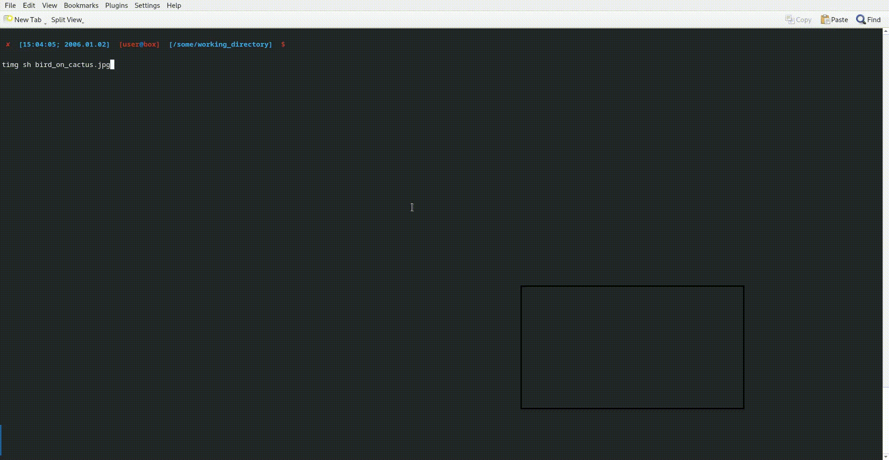

# TermImg

<!-- this readme is meant to be displayed in an
HTML-capable markdown pager (github via browser, etc) -->

termimg draws images into terminals.

[](https://pkg.go.dev/github.com/srlehn/termimg@master)
[](https://goreportcard.com/report/srlehn/termimg)

[](https://lbesson.mit-license.org/)

**VERY EXPERIMENTAL!!**

The rectangular drawing area for an image is given in cell coordinates (not pixels).
Origin is the upper left corner.

implemented drawing methods:
sixel, iTerm2, kitty, Terminology, DomTerm, urxvt, X11, GDI+, block characters

<details open><summary><h2>Example CLI Tool</h2></summary>

<blockquote><details open>
<summary><h3><span style="color:mediumseagreen">timg</span> CLI Tool</h3></summary>



installation:

```sh
go install github.com/srlehn/termimg/cmd/timg@master
```

usage:

```text
$ timg
timg display terminal graphics

Usage:
  timg [flags]
  timg [command]

Available Commands:
  completion  Generate the autocompletion script for the specified shell
  help        Help about any command
  list        list images
  properties  list terminal properties
  query       query terminal
  resolution  print terminal resolution
  runterm     open image in new terminal and screenshot
  scale       fit pixel area into a cell area while maintaining scale
  show        display image

Flags:
  -d, --debug    debug errors
  -h, --help     help for timg
  -s, --silent   silence errors

Use "timg [command] --help" for more information about a command.
```

The `list` command displays thumbnails of previewable files
for a given directory similar to "lsix":

```sh
timg list ~/Pictures
```

The `show` command draws the image in the current terminal:

```sh
timg show -p 10,10,15x15 picture.png
```

Cell coordinates are optional for the show command,
they are passed in this format: `<x>,<y>,<w>x<h>`
where x is the column, y the row, w the width and h the height.

If an error occurs the `--debug/-d` flag shows where in the code it happens.

The `runterm` command starts the terminal specified with the `-t` flag.
If no drawer is enforced by the optional `-d` flag, the best fitting one is used.
This command is meant for testing purposes.

```sh
timg --debug=true runterm -t mlterm -d sixel -p 10,10,15x15 picture.png
```

</details>

<blockquote></details>

<details open><summary><h2>Library Usage</h2></summary>

<blockquote><details><summary><h3>One-Off Image Draw</h3></summary>

```go
import (
    _ "github.com/srlehn/termimg/drawers/all"
    _ "github.com/srlehn/termimg/terminals"
)

func main(){
    defer termimg.CleanUp()
    _ = termimg.DrawFile(`picture.png`, image.Rect(10,10,40,25))
}
```

</details>

---

<details open><summary><h3>with NewImage…()</h3></summary>

For repeated image drawing create a term.Image via the NewImage…() functions.
This allows caching of the encoded image.

```go
import (
    _ "github.com/srlehn/termimg/drawers/all"
    _ "github.com/srlehn/termimg/terminals"
)

func main(){
    tm, _ := termimg.Terminal()
    defer tm.Close()
    timg := termimg.NewImageFileName(`picture.png`)
    _ = tm.Draw(timg, image.Rect(10,10,40,25))
}
```

</details>

---

<details><summary><h3>Advanced</h3></summary>

```go
import (
    _ "github.com/srlehn/termimg/drawers/sane"
    _ "github.com/srlehn/termimg/terminals"
)

func main(){
    wm.SetImpl(wmimpl.Impl())
    opts := []term.Option{
        term.SetPTYName(`dev/pts/2`),
        term.SetTTYProvider(gotty.New, false),
        term.SetQuerier(qdefault.NewQuerier(), true),
        term.SetResizer(&rdefault.Resizer{}),
    }
    tm, err := term.NewTerminal(opts...)
    if err != nil {
        log.Fatal(err)
    }
    defer tm.Close()
    var img image.Image // TODO load image
    timg := termimg.NewImage(img)
    if err := tm.Draw(timg, image.Rect(10,10,40,25)); err != nil {
        log.Fatal(err)
    }
}
```

The default options are packed together in `termimg.DefaultConfig`.
</details>

</blockquote></details>
